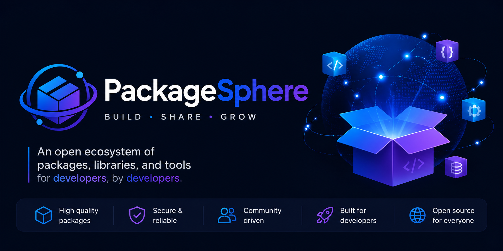

  

  An open-source organization building packages, libraries, and developer tools.

  
  
  

## About

PackageSphere is a community-driven organization focused on building reliable, well-documented software for developers. We maintain a growing collection of packages, tools, and libraries designed to be practical, maintainable, and easy to adopt.

## What We Build

- Packages & libraries
- CLI tools
- Developer utilities and SDKs
- Framework extensions
- Templates & starter kits

## Contributing

We welcome contributions of all kinds - bug fixes, documentation improvements, new features, or ideas. Check individual repositories for contribution guidelines before opening a pull request.

Built by the PackageSphere community.

